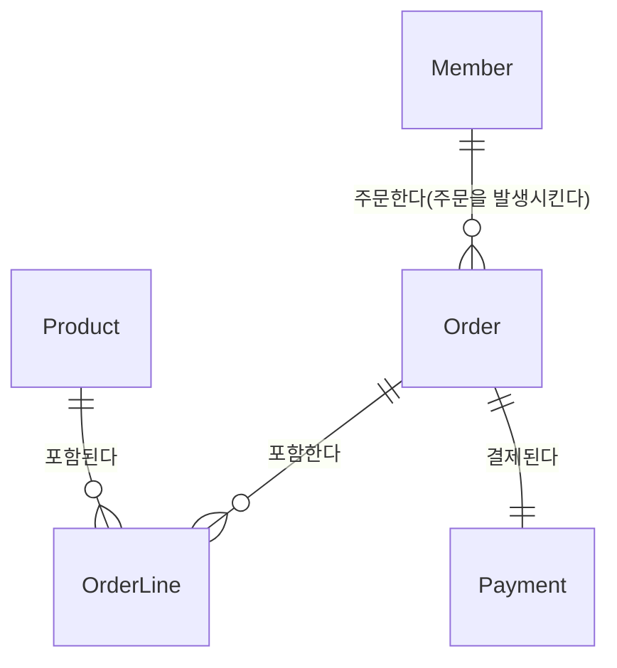

# AIPIA 백엔드 과제

## 개요

### 목표 시스템

회원 기반의 주문 시스템

### 프로젝트 실행 방법

- JDK 21이상 설치

## 프로젝트 아키텍처

- 도메인 기반의 레이어드 아키텍처

## 기술 요구사항

- Spring Boot를 기반으로 프로젝트를 생성하세요.
- 데이터 접근 계층은 Spring Data JPA를 활용하세요.
- 비즈니스 로직은 서비스 레이어에 구현하세요.
- 각 기능은 REST API 형태로 노출하세요.
- 회원가입
    - 비밀번호는 암호화되어 저장되어야 합니다.

## 기능 요구사항: 사용자 스토리 형식으로 작성

- 비회원은 서비스에 가입하고 로그인하여 회원으로써 서비스를 이용할 수 있다.
- 회원은 본인의 정보를 조회할 수 있다.
- 회원은 상품을 주문하고, 주문을 결제하여 주문을 완료할 수 있다.
- 회원은 자신의 주문을 조회하여 주문 상세 정보를 알 수 있다.
- 관리자는 상품을 관리(등록, 수정, 삭제)할 수 있다.
- 관리자는 회원을 조회하여 회원 상세 정보를 알 수 있다.
- 관리자는 주문을 조회하여 주문 상세 정보를 알 수 있다.

## 기능 세부 요구사항
- 회원가입
  - 이름은 최대 10자리 한글 문자열이어야 한다.
  - 이메일은 최대 50자리 이메일 형식의 문자열이어야 한다.
  - 비밀번호는 영어 대/소문자, 숫자로 구성된 최대 20자리의 문자열이어야 한다.
  - 휴대폰 번호는 010-xxxx-xxxx 형식의 문자열이어야 한다.
  - 이메일과 휴대폰 번호는 중복될 수 없다.
  - 가입한 회원의 등급은 회원(Member)이다.
- 주문
  - 총 주문 금액은 각 주문라인 주문 금액의 합이다.
  - 주문 라인의 주문 금액은 `상품 가격 * 수량`이다.
  - 주문시 최초 주문 상태는 `대기`이다.
  - 주문 상태는 `대기(PENDING)`, `성공(SUCCEEDED)`, `취소(CANCELED)`가 있다.
  - 주문시 재고를 차감한다.
  - 재고가 부족한 상품은 주문할 수 없다.
  - 주문시 요청한 총 주문 금액과 서버에서 계산된 총 주문 금액이 일치하지 않으면 주문할 수 없다.
- 결제
  - 외부 결제 시스템과 연동하여 결제를 처리한다.
  - 결제 시도시 결제 상태는 `대기(PENDING)`, `성공(SUCCEEDED)`, `실패(FAILED)`, `환불(REFUNDED)`, `취소(CANCELED)`가 있다.
  - 네트워크, 결제 시스템의 오류로 인해 외부 결제 시스템으로 전달된 요청이 실패할 경우 정해진 횟수만큼 결제 요청이 재시도 되어야 한다.

## 테스트 시나리오

- 비회원은 서비스에 가입하여 회원이 된다.
- 가입한 회원은 로그인하여 액세스 토큰을 발급 받는다.
- 회원은 본인의 정보를 조회한다.
  - 본인이 아닌 회원의 정보를 조회할 수 없다.
- 회원은 상품을 주문한다.
- 회원은 주문한 상품을 결제한다.
- 회원은 자신의 주문을 조회한다.

## 데이터 모델링

### ERD



Member ↔ Order (1:N)

- 한 회원은 여러 개의 주문을 발생시킬 수 있습니다.

Order ↔ OrderLine (1:N)

- 한 주문은 여러 개의 주문라인이 포함할 수 있습니다.

Product ↔ OrderLine (1:N)

- 한 상품은 여러 주문라인에 포함될 수 있습니다.

Order ↔ Payment (1:1)

- 한 주문당 하나의 결제 정보를 가집니다.

## 엔터티 상세

### 1. Member (회원)

| 필드명          | 데이터 타입   | 제약 조건  | 설명        |
|--------------|----------|--------|-----------|
| id           | BIGINT   |        | 고유 식별자    |
| name         | VARCHAR  |        | 이름        |
| email        | VARCHAR  | UNIQUE | 이메일       |
| password     | VARCHAR  |        | 암호화된 비밀번호 |
| phone        | VARCHAR  |        | 휴대폰 번호    |
| grade        | VARCHAR  |        | 등급        |
| joined_at    | DATETIME |        | 가입 일시     |
| withdrawn_at | DATETIME |        | 탈퇴 일시     |

### 2. Product (상품)

| 필드명           | 데이터 타입      | 제약 조건 | 설명     |
|---------------|-------------|-------|--------|
| id            | BIGINT      |       | 고유 식별자 |
| name          | VARCHAR(50) |       | 이름     |
| price         | DECIMAL     |       | 단가     |
| stock         | INTEGER     |       | 수량     |
| description   | TEXT        |       | 설명     |
| deleted       | BOOLEAN     |       | 삭제 여부  | 
| registered_at | DATETIME    |       | 등록 일시  |

### 3. Order (주문)

| 필드명        | 데이터 타입   | 제약 조건 | 설명        |
|------------|----------|-------|-----------|
| id         | BIGINT   |       | 고유 식별자    |
| member_id  | BIGINT   |       | 주문한 회원 ID |
| amount     | DECIMAL  |       | 총 주문 금액   |
| status     | VARCHAR  |       | 상태        |
| ordered_at | DATETIME |       | 주문 일시     |

### 4. OrderLine (주문 라인)

| 필드명              | 데이터 타입  | 제약 조건 | 설명          |
|------------------|---------|-------|-------------|
| id               | BIGINT  |       | 고유 식별자      |
| order_id         | BIGINT  |       | 주문 ID       |
| product_id       | BIGINT  |       | 상품 ID       |
| product_name     | VARCHAR |       | 주문 당시 상품명   |
| product_quantity | INT     |       | 주문 상품 수량    |
| product_price    | DECIMAL |       | 주문 당시 상품 단가 |
| amount           | DECIMAL |       | 주문라인의 주문 총액 |

### 5. Payment (결제)

| 필드명            | 데이터 타입   | 제약 조건 | 설명                                                               |
|----------------|----------|-------|------------------------------------------------------------------|
| id             | BIGINT   |       | 고유 식별자                                                           |
| group_id       | BIGINT   |       | 결제 그룹 식별자. 승인된 결제 건에 대한 환불, 부분 환불이 진행된다면 각 결제 건들은 같은 그룹 식별자를 갖는다 |
| order_id       | BIGINT   |       | 주문 ID                                                            |
| transaction_id | VARCHAR  |       | 거래 고유 번호: 결제 처리 주체(PG, VAN)으로부터 부여됨                              |
| amount         | DECIMAL  |       | 결제 총액                                                            |
| status         | VARCHAR  |       | 상태                                                               |
| created_at     | DATETIME |       | 결제 생성 일시                                                         |
| paid_at        | DATETIME |       | 결제 성공 일시                                                         |
| refunded_at    | DATETIME |       | 환불 일시                                                            |

## API 명세서

### 공통 응답 모델

**오류**

```json
{
  "code": "AIPIA-0001",
  "message": "이미 존재하는 휴대폰 번호입니다."
}
```

**상세 오류**

```json
{
  "code": "AIPIA-0001",
  "message": "이미 존재하는 휴대폰 번호입니다.",
  "detailMessage": "phone='010-1111-2222'"
}
```

### 로그인 API

`POST /api/auth/login`

**요청 본문**

| 필드명      | 타입     | 필수 여부 | 설명   | 제약조건                           |
|----------|--------|-------|------|--------------------------------|
| email    | string | Y     | 이메일  | 최대 50자리 이메일 형식의 문자열            |
| password | string | Y     | 비밀번호 | 영어 대/소문자, 숫자로 구성된 최대 20자리의 문자열 |

**응답**:

- 로그인 성공: 200 OK
    ```json
    {
        "accessToken": "JWT 형식의 문자열"
    }
    ```

### 회원가입 API

`POST /api/members`

**요청 본문**

| 필드명      | 타입     | 필수 여부 | 설명     | 제약조건                           |
|----------|--------|-------|--------|--------------------------------|
| name     | string | Y     | 이름     | 최대 10자리 한글 문자열                 |
| email    | string | Y     | 이메일    | 최대 50자리 이메일 형식의 문자열            |
| password | string | Y     | 비밀번호   | 영어 대/소문자, 숫자로 구성된 최대 20자리의 문자열 |
| phone    | string | Y     | 휴대폰 번호 | 010-xxxx-xxxx 형식의 문자열          |

**응답**:

- 회원가입 성공: 201 Created
- 휴대폰 번호 중복: 409 Conflict
  ```json
    {
        "code": "AIPIA-0001",
        "message": "이미 존재하는 휴대폰 번호입니다."
    }
  ```
- 이메일 중복: 409 Conflict
  ```json
    {
        "code": "AIPIA-0002",
        "message": "이미 존재하는 이메일입니다."
    }
  ```

### 회원 단건 조회 API

`GET /api/members/{memberId}`

**요청 헤더**

| 헤더명           | 값                     | 설명                                     |
|---------------|-----------------------|----------------------------------------|
| Authorization | Bearer {Access Token} | 사용자 인증 헤더. 로그인시 발급 받는 접근 토큰을 전달해야 한다. 사용자의 권한은 관리자여야 한다. |

**요청 쿼리 파라미터**

| 필드명      | 타입   | 필수 여부 | 설명        |
|----------|------|-------|-----------|
| memberId | Long | Y     | 회원 고유 식별자 |

**응답**:

- 조회 성공 (탈퇴하지 않은 회원): 200 OK
    ```json
    {
     "id":  1, 
     "name": "김길동",
     "email": "gdkim@gmail.com",
     "phone": "010-1111-2222",
     "grade": "MEMBER",
     "joinedAt": "2023-10-01T12:00:00"
    }
    ```
- 조회 성공 (탈퇴한 회원): 200 OK
    ```json
    {
     "id":  1, 
     "name": "홍길동",
     "email": "gdhong@gmail.com",
     "phone": "010-3333-4444",
     "grade": "MEMBER",
     "joinedAt": "2023-10-01T12:00:00",
     "withdrawnAt": "2025-10-01T12:00:00"
    }
    ```

### 회원 본인 조회 API

`GET /api/members/me`

**요청 헤더**

| 헤더명           | 값                     | 설명                                     |
|---------------|-----------------------|----------------------------------------|
| Authorization | Bearer {Access Token} | 사용자 인증 헤더. 로그인시 발급 받는 접근 토큰을 전달해야 한다. |

**응답**:

- 조회 성공 (탈퇴하지 않은 회원): 200 OK
    ```json
    {
     "id":  1, 
     "name": "김길동",
     "email": "gdkim@gmail.com",
     "phone": "010-1111-2222",
     "grade": "MEMBER",
     "joinedAt": "2023-10-01T12:00:00"
    }
    ```
- 탈퇴한 회원: 403 Forbidden
  ```json
    {
        "code": "AIPIA-0008",
        "message": "탈퇴한 회원은 조회할 수 없습니다."
    }
  ```

### 상품 생성 API

`POST /api/products`

**요청 헤더**

| 헤더명           | 값                                      | 설명                                                       |
|---------------|----------------------------------------|----------------------------------------------------------|
| Authorization | Bearer {Access Token with Admin grade} | 사용자 인증 헤더. 로그인시 발급 받는 접근 토큰을 전달해야 한다. 사용자의 권한은 관리자여야 한다. |

**요청 본문**

| 필드명          | 타입      | 필수 여부 | 설명    |
|--------------|---------|-------|-------|
| name         | String  | Y     | 이름    |
| price        | Integer | Y     | 가격    |
| stock        | Integer | Y     | 수량    |
| description  | String  | Y     | 설명    |

**응답**:

- 상품 생성 성공: 201 Created

### 주문 생성 API

`POST /api/orders`

**요청 헤더**

| 헤더명           | 값                     | 설명                                   |
|---------------|-----------------------|--------------------------------------|
| Authorization | Bearer {Access Token} | 사용자 인증 헤더. 로그인시 발급 받는 접근 토큰을 전달해야 한다 |

**요청 본문**

| 필드명        | 타입              | 필수 여부 | 설명        |
|------------|-----------------|-------|-----------|
| memberId   | Long            | Y     | 회원 고유 식별자 |
| orderLines | OrderLine 객체 배열 | Y     | 주문 라인(들)  |
| amount     | DECIMAL         | Y     | 총 주문 금액   |

OrderLine 객체

| 필드명             | 타입      | 필수 여부 | 설명          |
|-----------------|---------|-------|-------------|
| productId       | BIGINT  | Y     | 상품 ID       |
| productQuantity | INT     | Y     | 주문 상품 수량    |
| productPrice    | DECIMAL | Y     | 주문 당시 상품 단가 |
| amount          | DECIMAL | Y     | 주문라인의 주문 총액 |

**응답**:

- 주문 생성 성공: 201 Created

### 주문 결제 API

`POST /api/orders/{orderId}/pay`

**요청 헤더**

| 헤더명           | 값                     | 설명                                   |
|---------------|-----------------------|--------------------------------------|
| Authorization | Bearer {Access Token} | 사용자 인증 헤더. 로그인시 발급 받는 접근 토큰을 전달해야 한다 |

**요청 경로 변수**

| 필드명     | 타입   | 필수 여부 | 설명        |
|---------|------|-------|-----------|
| orderId | Long | Y     | 주문 고유 식별자 |

**요청 본문**

| 필드명                        | 타입     | 필수 여부 | 설명              |
|----------------------------|--------|-------|-----------------|
| cardNumber                 | String | Y     | 카드 번호           |
| cardExpirationYearAndMonth | String | Y     | 카드 만료 연월 'MMYY' |
| cardIssuerCode             | String | Y     | 카드 발급사 코드       |

**응답**:

- 주문 생성 성공: 200 Created

## 해야 할 일

- [x] 설계
    - [x] 요구사항 작성
    - [x] 데이터 모델링
    - [x] API 명세서 작성
    - [x] 테스트 시나리오 작성
- [ ] 구현
    - [x] 회원가입 API
    - [x] 로그인 API
    - [x] 회원 단건 조회 API
    - [x] 상품 생성 API
    - [x] 주문 생성 API
    - [ ] 주문 결제 API
    - [ ] 주문 단건 조회 API